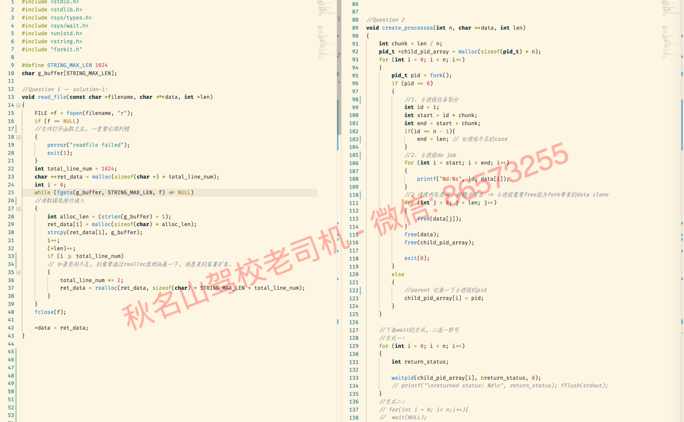

# 🖥 机考笔记仓库 📝

在开始看代码之前, 可以打开 [computer2_进程讲义与Insight讲义.pdf](computer2_进程讲义与Insight讲义.pdf)

如果你要读文件:
* [demo_readLineByLine_via_fgets__读文件模板1.c](demo_readLineByLine_via_fgets__读文件模板1.c): line by line 地读文件, 最推荐的做法.
* [demo_read_charByChar_via_fgetc__读文件模板2.c](demo_read_charByChar_via_fgetc__读文件模板2.c): char by char 地读文件, 如果程序的目标是处理char流(例如第一个上机weekly-lab), 则用这个模板.
* [demo_readWordByWord_via_fscanf_读文件模板3.c](demo_readWordByWord_via_fscanf_读文件模板3.c): word by word 地读文件.

如果你想一个parent, 然后fork出来多个child来进并行执行多任务, 你可以用:
* [demo_parent_fork_N_child_多进程模板.c](demo_parent_fork_N_child_多进程模板.c): 多进程编程的模板

如果你想在进程之间通信, 那么最佳方式之一就是管道("pipe"):
* [demo_pipe0.c](demo_pipe0.c): 自己跟自己管道通信, 没什么意义, 仅仅是示范管道的读写功能.
* [demo_pipe1.c](demo_pipe1.c): parent->children, 单向通信
* [demo_pipe2.c](demo_pipe2.c): parent->children, 双向通信

最后, 我们来看看, 如何用以上的知识点和模板, 来解决今年的insight问题
* [computer_insight](computer_insight): 里面则包含了关于insight prac的solution.
    * q1是读文件, 可以套用按行读文件的模板
    * q2是多进程并行执行任务, 可以套用进程模板.

另外, 再附送一个单向[linkedlist模板](linkedlist), 以防万一会考linkedlist的细节. 至于更多的linkedlist应用细节, 可以参照我讲解的去年机考题.